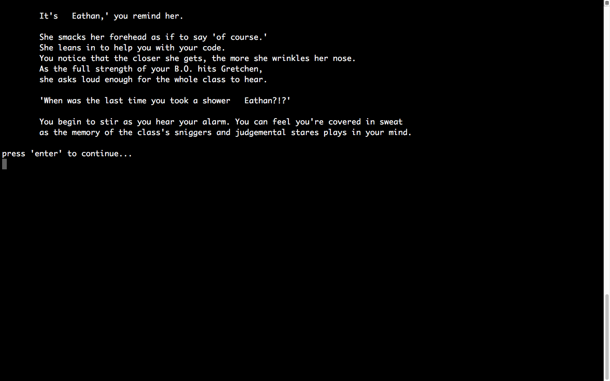

# The Morning Struggle

[Xian's Github](https://github.com/xianll/XIANLL.GITHUB.IO)

### Inspiration
---

We decided to go with a "choose your own adventure" style game. Our inspiration came from the choose your own adventure goosebumps books from R. L. Stine.

And early interactive text-based game like Zork. 

### Purpose 
---
We thought it would be a fun challenge to make a functioning game that has many permutations given user inputs. 

### Functionality
---
A game's primary function is to entertain, and we hope our game does. 

### Instructions
---
The app will launch and present the user with choices (eg. type < a > if you want to choose option a). Entering your option choices will prompt the story to move along.

### Screenshots
---
The outcome of our first set of choices.

Outcome after asking for the player's name.

Another option page in the game.

## Design and Planning
---
### Project Plan
---

We tossed around a few app ideas before we settled onto our favourite.

Once we settled on the choose your own adventure, we drew up a user/workflow diagram.

Our Trello board in the early stages of the project

### Pain Points
---
We realised early on that there was going to be a lot of story text that we had to provide so we prioritised finalising the storyline and its options before we began coding. 
   
Block and blocks of story text.

We struggled a bit with the architecture of our code and weren't sure which control flow structure we should use. When we started coding, we used 'case' to show and direct user options and that worked well given the simplicity of the code at the beginning. 

As we moved deeper into the story, however, and more permutations to the story needed to be accommodated for, we found that 'case' was no longer adequate. After some consultation, we decided to go with modules. This allowed us to separate big blocks of text from our code and let's us access and analyze our code much easier.

The code still became quite long and fiddly given the nature of a choose your own adventure. 

### Improvements
---
1. Matt suggested we set our blocks of text into variables so that our code reads much easier. 

2. Further research before we start into what control structures would have best suited our needs. 

3. Utilizing hashes in our code so that we may access all elements throughout all points of our story.
   
4. Using a pre-existing story so that our main focus is on 
   the code, and not writing. 

5. In trying to make the decisions our players make matter further along the story, we encoutered the issue of the player no longer being able to make more decisions as they're just presented with the consequences of their earlier decisions.

### Further Development
---
Given more time, we would have liked to:
1. Provide more options to the player for a richer gaming experience.

2. Polish the overall look of the game.

3. Implementing an inventory system in the game.

4. Implement a karma tracking device to punish players for their less moral decisions.
--- 
##### A terminal app by Eathan and Xian 

   
